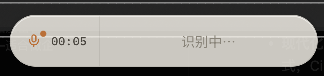
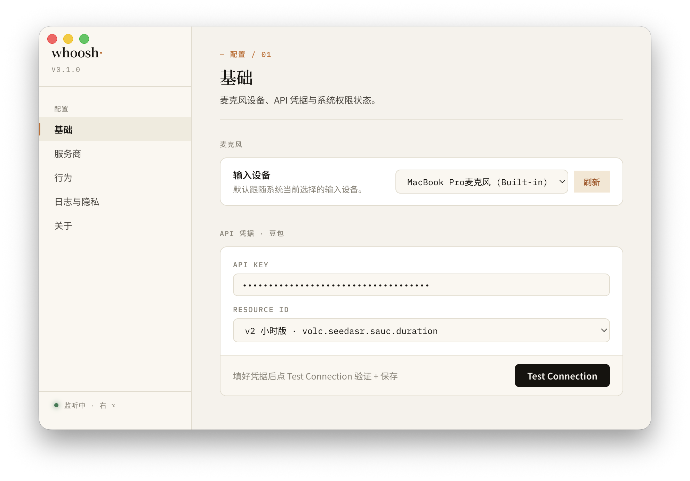

# whoosh

按住 → 说话 → 松开 → 文字落到你正在打字的地方。

跨平台 AI 语音输入法。常驻 macOS menubar 或 Windows tray，按住右 Option / 右 Ctrl 录音，松开后流式 ASR 出文本，一次性粘贴到当前聚焦的 app —— 任何能输入文字的 app 都能用。



## 特点

- **零摩擦触发** —— 全局按键监听，不用切窗口、不用打开 app
- **流式识别** —— WebSocket 持续推送 partial text，HUD 实时显示
- **一次性粘贴** —— 松开瞬间把完整文本写入剪贴板并触发 ⌘V / Ctrl+V
- **零远程上报** —— 无 telemetry、无 analytics、无 Sentry；`info` 级日志不记录转录文本
- **剪贴板隐私** —— macOS 标记 `org.nspasteboard.ConcealedType`、Windows 标记 `ExcludeClipboardContentFromMonitorProcessing`，不入剪贴板管理器历史
- **后台运行** —— macOS menubar (`LSUIElement`)、Windows tray，没 dock / 没 taskbar
- **可扩展 provider** —— 当前接入豆包 Seed ASR，抽象层完整可加更多

## 安装

下载对应平台的安装包，详见 [Releases](https://github.com/Anthoooooooony/whoosh-electron/releases/latest)：

| 平台          | 文件                         |
| ------------- | ---------------------------- |
| macOS (arm64) | `whoosh-<version>-arm64.dmg` |
| Windows (x64) | `whoosh Setup <version>.exe` |

> 自用规模 · **未签名 · 未公证**。
> macOS 首次启动若被 Gatekeeper 拦截，到 _系统设置 → 隐私与安全性_ 点「仍要打开」。
> Windows 首次启动会触发 SmartScreen「未知发布者」提示，点「更多信息 → 仍要运行」。

## 配置

启动后会进入 onboarding：

1. **API 凭据** —— 填入豆包 Seed ASR 的 App ID / Access Token / Resource ID，点「Test Connection」校验
2. **麦克风权限** —— 授权 app 访问录音设备
3. **辅助功能权限**（macOS 限定）—— 监听全局键盘 + 模拟粘贴需要 Accessibility
4. **试用** —— 现场试一次语音输入，确认链路通

## 使用

按住 **右 Option**（macOS）或 **右 Ctrl**（Windows） → 说话 → 松开。HUD 出现在屏幕底部中央，松开后识别结果会自动粘贴到当前聚焦的输入框。

操作小贴士：

- 录音中把指针移到 HUD 上 → HUD 变为「取消转录」按钮，松开即弃稿
- 松开后会有短暂「识别中」状态，等流式收尾确认后才粘贴
- 出错（麦克风占用 / 网络 / 鉴权 / 配额）会在 HUD 显示具体原因约 2s



设置项分 5 节：Setup（设备/凭据/权限）· Provider（ASR 参数）· 行为（触发键/开机自启/HUD 开关）· 日志与隐私 · 关于。

## 开发

```bash
pnpm install
pnpm dev          # electron-vite dev：4 个 renderer + main 全部热重载
pnpm build        # 出产物到 out/
pnpm test         # vitest run
pnpm typecheck    # tsc --noEmit
pnpm lint         # eslint
```

环境要求：Node ≥ 22.13、pnpm@11.0.9（仓库已 lockstep）。打包用 electron-builder，CI 矩阵 build macOS arm64 + Windows x64。

## 协作

工程约定（Conventional Commits、commit type 收窄到 `feat:` / `fix:` / `docs:`、release-please 自动发版链路、跨平台触发键约定等）见 [CLAUDE.md](./CLAUDE.md)。

Issue / triage / 工作流参考 `docs/agents/`。历史设计快照（M1→M16 实施蓝图、原始视觉 mock）在 `archive/`。

---

豆包 ASR 是字节跳动的产品；本项目与字节跳动无关联。
